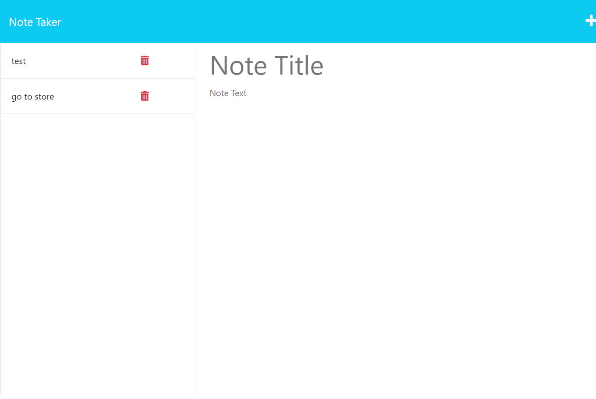

# Express Note Taker
     

## Description

This project showcases backend routes to allow a front end application to work as intended. This application allows the user to add, save, and delete notes with the click of a button. Information is saved on page refresh and is available until deleted. The project helped me understand the basics of how server routing works and how to tie the front end of the application to the back end server using middleware and routes. Modules used were Node, FS, Express, path, and uniqid. The most challenging aspect of the project was trying to debug a major error in my pathing. I accidentally put files in the wrong folder and they were not able to communicate, causing syntax errors.

---

## Table of Contents

Title --- Express Note Taker
* [Description](#description)
* [Installation](#installation)
* [Usage](#usage)
* [License](#license)
* [Contributing](#contributing)
* [Tests](#tests)
* [Questions](#questions)

---

## Installation

Installation is not required to run this application. If you would like to install locally, download the repository, run server.js locally and open a browser to localhost:3001.

---

## Usage

To use this application, navigate to https://xpress-note.herokuapp.com/ and click the button to get started. To add a note, simply type a title and text in the fields on the page. To save, hit the save button in the top right corner (fields must not be empty). To delete a note, hit the delete button next to the note you would like to delete. To view a note, click on the note itself. To view a .json file of all the notes, navigate to https://xpress-note.herokuapp.com/api/notes.

---

## Screenshot

---

## License

This project is licensed under the MIT License.

---

## Contributing

This code was written by Michael Reagan. Classmate Rex and ChatGPT assisted in the debugging process. 

---

## Tests

no testing suites available for this application.

---

## Questions

For questions or comments, please email me at emparode@gmail.com.

My Github profile is located at [https://github.com/MCReagan](https://github.com/MCReagan).

---
